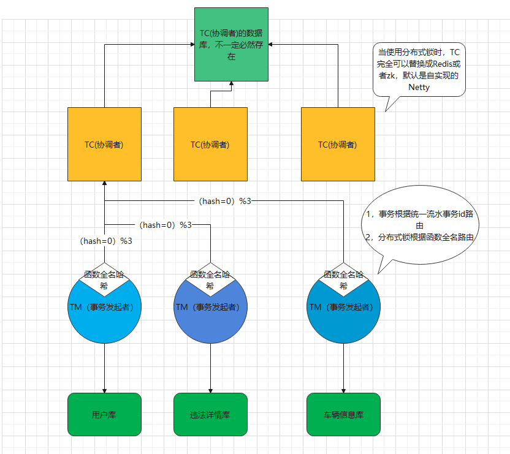

# ef-coordinator

## 介绍
ef-coordinator是EF家族的一员，本人追求简单高效，所以EF的意思是easyFast。coordinator的意思是协调者

###coordinator功能介绍

coordinator实现了注解驱动的分布式事务和分布式锁，细粒度为函数

基于Spring boot框架开发，具有Spring低代码侵入性的特点。

###coordinator架构简介

分布式事务整体角色分为TC(协调者)，TM（事务发起者）和支持事务回滚的数据源

集群特性：

TM（事务发起者）：天然可以是集群或者单机

TC(协调者)：默认单机,最近可能提供哈希一致结合数据库持久化的集群版

支持事务回滚的数据源：与框架本身无关，只要支持事务即可，只是提供数据持久化，事务提交实现了

@Around("execution(* javax.sql.DataSource.getConnection(..))")即可使用

###coordinator开发框架
Java+Netty+Spring Boot
TC使用Spring Boot只是简化启动过程编写，依赖了boot的载入配置文件和启动器
## 软件架构



## 安装教程

TC：maven打包即可
TM:本地打包，添加引用，或者直接把工程引用到项目中

## 使用说明
###coordinator实现分布式事务
所有链路上都实现了 @GlobalTransaction
同时上游需要使用 RestTemplate向下引用   
```
@Autowired
private RestTemplate restTemplate;
```
上游：
```
 @GetMapping("/save")
    @GlobalTransaction
    @Transactional
    public void save() {
        jdbcTemplate.execute("insert into t_goods values(1, 'iphone')");
        HttpHeaders headers = new HttpHeaders();
        headers.set("xid", GlobalTransactionManager.getCurrentXid());
        HttpEntity<JSONObject> httpEntity = new HttpEntity<>(headers);
        restTemplate.postForObject(requestUrl+"/save", httpEntity, String.class);
        int i = 100 / 0;
    }
```
下游:
```
   @PostMapping("/save")
    @GlobalTransaction
    @Transactional
    public String save() {
        jdbcTemplate.execute("insert into t_order values(1, 'iphone order')");
        return "OK";
    }
```
####coordinator实现分布式事务
1，添加@GlobalLock
2，需要扫描到指定的实体类
3，需要实体类被Spring反向代理
```
    @GetMapping("/lock")
    @GlobalLock
    public String lock() {
        try {
            Thread.sleep(4000);
        }catch (Exception e){

        }
        return "ok";

    }
```
##实现原理
###coordinator分布式事务
1，面向切面，代理切点函数
2，借助RestTemplate统一事务id
3，堵塞Spring的事务提交交由tc统一处理
4，tc统一管理和控制整体事务

###coordinator分布式锁
1，面向切面，代理切点函数
2，借助面向切面统一事务id-》函数名
3，第一阶段整体：获取和释放本地锁
4，第二阶段整体：获取和释放TC端的锁
5，TC使用全局锁+堵塞队列实现分布式锁，其思路参考J.U.C中的线程池
## 致敬
京东的JDhotkey的开发参与者
阿里的seata的开发参与者
阿里的Dubbo的开发参与者
提前致敬阿里的sentinel的开发参与者
部分Netty启动，编解码，拆包封包致敬了京东的JDhotkey框架
分布式事务架构角色参考了seata的思路
Dubbo整体思路的始祖
准备参照sentinel增加一套注解驱动的服务拒绝策略，配合分布式锁使用

